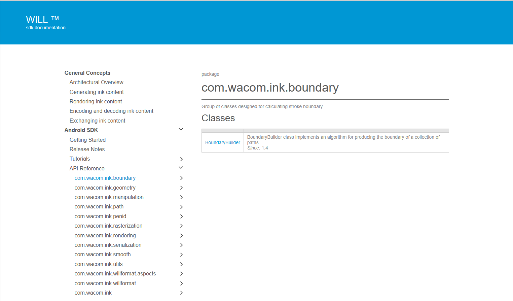

# Getting Started 

## Android Development environment

The WILL SDK for Ink requires the Android SDK - API Level 15 or above.


## Download the SDK

Download the SDK from https://developer.wacom.com/developer-dashboard

* Login using your Wacom ID
* Select **Downloads for ink**
* Download **WILL SDK for Android**
* Accept the End User License Agreement to use the SDK

The downloaded Zip file contains the SDK with documentation.


## SDK license

The SDK is free of charge and does not need a license.

## Using the WILL SDK

The WILL SDK for Android is distributed as an Android Library.

Install the latest version of Android Studio.
Add the WILL SDK library (the .aar file in sdk\will) as a module to your Android Studio project using the 'Import .JAR/.AAR Package' option.
Perform a project sync.

## Using ProGuard on WILL SDK

Using ProGuard with the SDK will lead to invalid signatures of native methods.
In order to prevent such problems the WILL SDK must not be obfuscated.
The following ProGuard rules need to be added in the proguard-rules.pro file in order to disable ProGuard for classes inside the WILL SDK package:
```
# Suppress warnings if you are not using WILL SDK
-dontwarn com.wacom.ink.**
# Tell ProGuard to keep WILL SDK as it is
-keep class com.wacom.ink.** {*;}
```

## Tutorials

The following tutorials demonstrate how to use WILL SDK for Android: 


* [Tutorial 1: Drawing with touch](will-tutorials/drawing-with-touch/README.md)
* [Tutorial 2: Encoding and decoding strokes](will-tutorials/stroke-encoding-and-decoding/README.md)
* [Tutorial 3: Erasing strokes](will-tutorials/erasing-strokes/README.md)
* [Tutorial 4: Selecting strokes](will-tutorials/selecting-strokes/README.md)
* [Tutorial 5: Working with rasters](will-tutorials/working-with-rasters/README.md)
* [Tutorial 6: Using Pen Ids](will-tutorials/using-penid/README.md)

Each tutorial is sub-divided into parts that describe how to accomplish particular tasks.
The sample code in the tutorials is written in Java, and each tutorial has an associated Android application project that can be compiled and run using the latest Android SDK.

## API Reference

In the downloaded SDK open this file in a browser:

`documentation\index.html`

The page gives access to the API Reference section:



----

​        


