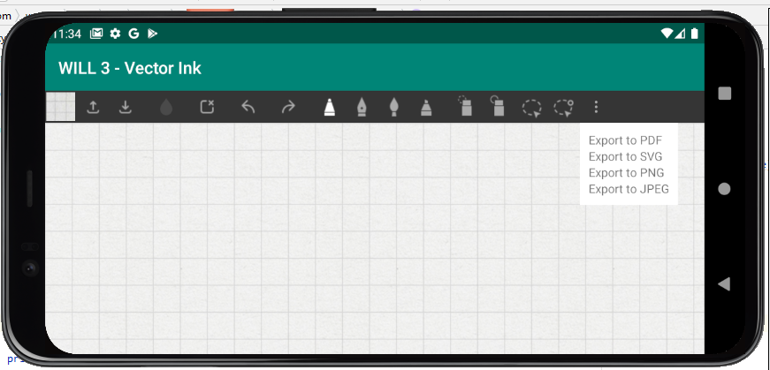

# Getting Started 

## Android Development Environment

The WILL SDK for Ink requires the following:

- Android Studio 3.4. 
- The WILL SDK for Ink (v3.0) requires the Android SDK - API Level 15 or above.

## Download the SDK

Download the SDK from https://developer.wacom.com/developer-dashboard

* Login using your Wacom ID
* Navigate to **Downloads for ink**
* Select **More info** on **WILL SDK for ink for Android**
* Accept the End User License Agreement and select **Download** to use the SDK

The downloaded Zip file contains the SDK with documentation.

## SDK license

The SDK does not require a license key. Use of the SDK is subject to the End User License Agreement. 

## Sample code

Separate samples are supplied:

#### WILL3-Ink-Vector-Rendering-Demo
This demo shows how to create and manipulate vector-ink graphics.

#### WILL3-Ink-Raster-Renderion-Demo
This demo shows how to create and manipulate raster-ink graphics.

The sample code includes individual README pages describing the operation. The additions provided by the InkModel Export Utilities will be covered here.

### Exporting Ink

In the menu, select the top-right set of dots. This will prompt a drop-down menu giving a list to formats to export to.

The user may then export the file to a format of their choosing.

## API Reference

API documentation is included in the downloaded SDK as well as in the [api folder](api/digital-ink-kotlin/index.md)

----

​        

