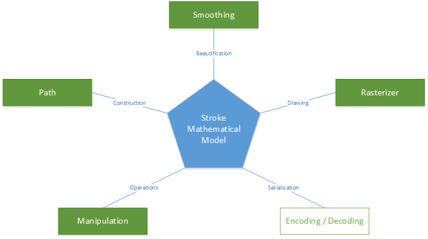
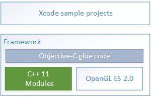
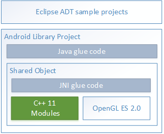
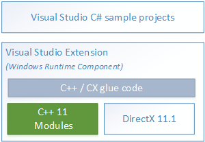
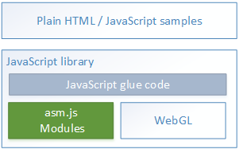

# WILL SDK for ink - Android

WILL (Wacom Ink Layer Language) is a cross-platform universal ink solution.
The WILL SDK for ink is a Software Development Kit (SDK) that allows you to include premium digital inking features in your applications.
Its modularized architecture allows each module to be configured, replaced, or omitted as required by the specific application, providing you with superior flexibility.
You can also use the WILL open file format (.will) to exchange ink content between applications.

The WILL SDK for ink includes:

* A software library
* Code samples illustrating particular functionality
* The Tool Configurator - a fully functional demo application
* Comprehensive documentation, including step-by-step tutorials
* Articles describing advanced programming techniques and best practices

## Digital ink

Digital ink (referred to in this documentation as ink) content comprises of strokes.
These are usually, but not necessarily, created with a pointing device.
Strokes have certain graphical characteristics and can be optionally associated with other data or metadata.
You can digitally store and share ink content using various models - vector-based, pixel-based, or hybrid.

## Ink content exchange

The WILL file format is similar to SVG, but is specifically designed to accommodate digital ink content.
It is used for exchanging ink content between devices and applications, and is implemented as an open and extensible binary format.

Note that the main modules of the WILL software library do not rely on a specific file format.
You can use alternatives to the WILL file format (for example, InkML, SVG, or PNG) to exchange handwritten content, according to specific application requirements.

## Software library

WILL supports a variety of input technologies and generates the best possible ink through the use of two dedicated modules, **Path** and **Smoothing**, that take into account the specific characteristics of each input type.
The Rasterizer module then provides advanced real-time stroke rendering.
The **Manipulation** module supports editing functions that leverage the WILL stroke mathematical model (referred to as the stroke model in this documentation).
The **Serialization** module encodes and decodes stroke data.

In more detail:

* The **Path** module converts raw input into the stroke model.
  The stroke model is a mathematical model optimized for stroke representation.
  It improves on traditional models for 2D graphics: the stroke is represented using Catmull-Rom interpolation over a sequence of control points, but in addition to x and y co-ordinates, each control point can have width and opacity values.

* The **Smoothing** module enhances and enriches the stroke representation.

* The **Rasterizer** module provides APIs that are compatible with the stroke model.
  It uses three rendering back-ends that are built on OpenGL ES 2.0, DirectX 11.1, and WebGL respectively, providing full hardware acceleration on most platforms.
  The APIs facilitate raster-based techniques such as caching and masking.
  These techniques can be used to implement features such as preliminary curves, pixel transformations, and pixel-based manipulations on free-form selections.

* The **Manipulation** module provides a set of algorithms that operate over the stroke model.
  These algorithms can be used as building blocks to implement functions such as selecting, erasing, cutting, copying, and pasting.

* The **Serialization** module provides a binary encoding algorithm designed to support the stroke model.
  This algorithm is based on Google protocol buffers, which makes the resulting binary code open and platform-independent.

The WILL software library also provides a range of utility algorithms, including:

* An algorithm that calculates the boundaries of strokes described by the stroke model, and represents them as a collection of cubic Bezier curves.
  This algorithm can represent strokes using traditional 2D vector graphics models.
  The resulting representation can be serialized in traditional vector formats like PDF and SVG, or rendered using traditional 2D graphics libraries like Quartz 2D or Direct2D, or as HTML 5 canvas elements, or Android Canvas instances.

* An algorithm that produces a unique identifier based on the input device.
  You can use this functionality, which works exclusively with Wacom devices, to distinguish different users by their pens.

## Platform support

The WILL ink SDK provides platform-specific packages for iOS, Android, Windows Store, and Web.
These packages provide a deep integration with the hosting platform by using native packaging and programming techniques, and by providing platform-specific language bindings for all modules in the software library.

Software applications often combine ink with other content, such as typed text and images.
The platform-specific packages provide the flexibility and extensibility required to tightly integrate WILL with any application.

Platform-specific tutorials illustrate the use of the software library modules.
Source code is provided in each case, and files use a naming convention that reflects the numerical ordering of topics in the Tutorials section of the documentation for each platform.

### iOS

The iOS software library is packaged as a framework, and Objective-C language binding allows iOS developers to use the preferred language of the platform.

### Android

The Android software library is packaged as a native library (shared object) wrapped in an Android library (JAR).
Java language binding allows Android developers to use the preferred language of the platform and easily integrate ink content inside the View hierarchy.

### Windows

The Windows Store software library is packaged as an unmanaged Windows Runtime Component.
It can be used from any language supported by Windows Runtime (WinRT), whether inside a managed or an unmanaged environment.

### Web

The Web software library is packaged as a JavaScript module with an asm.js program.
It can be used by any standard HTML 5 application as a regular JavaScript library.

---

# Additional resources 

## Sample Code
For further samples check Wacom's Developer additional samples, see [https://github.com/Wacom-Developer](https://github.com/Wacom-Developer)

## Documentation
For further details on using the SDK see [Wacom SDK for ink documentation v2](http://will-docs.westeurope.cloudapp.azure.com/sdk-for-ink/docs/2.0.0/overview) 

The API Reference is available directly in the downloaded SDK.

## Support
If you experience issues with the technology components, please see related [FAQs](http://will-docs.westeurope.cloudapp.azure.com/faqs)

For further support file a ticket in our **Developer Support Portal** described here: [Request Support](http://will-docs.westeurope.cloudapp.azure.com/faqs/docs/q-support/support)

## Developer Community 
Join our developer community:

- [LinkedIn - Wacom for Developers](https://www.linkedin.com/company/wacom-for-developers/)
- [Twitter - Wacom for Developers](https://twitter.com/Wacomdevelopers)

## License 
This sample code is licensed under the [MIT License](https://choosealicense.com/licenses/mit/)

---
