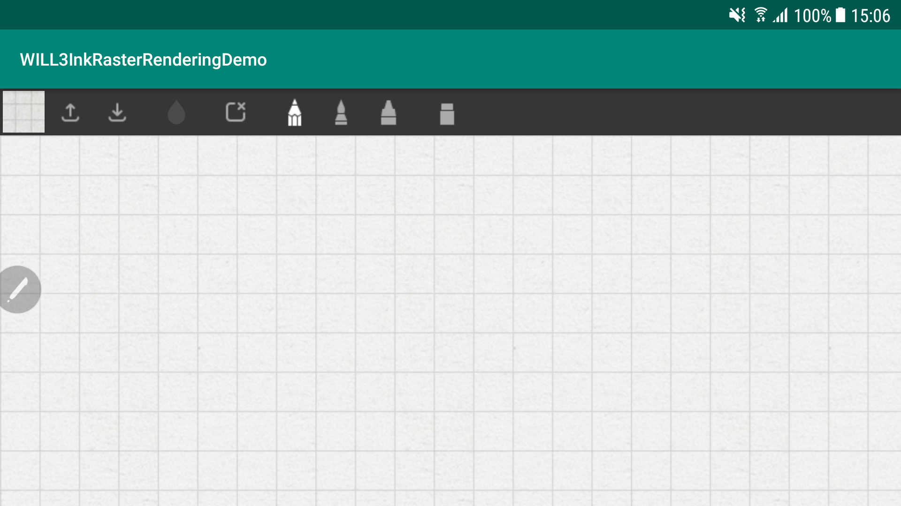

# WILL SDK for ink (v3.0) - Android Raster rendering demo


## Description
The purpose of this sample tutorial is to demonstrate how to use WILL SDK for ink (v3.0) to create raster-based ink strokes into Android applications.

### Key Features
- Particle brushes with custom brush texture
- Configurable pipeline for transforming pointer input to ink geometry
- Support for pointer pressure, tilt and velocity
- Smoothing of input values
- Variable color/transparency for particle brushes


# Getting Started
## Development Environment
- Android Studio 3.4. 
- The WILL SDK for Ink (v3.0) requires the Android SDK - API Level 15 or above.

## Download the SDK

Download the SDK from https://developer.wacom.com/developer-dashboard

* Login using your Wacom ID
* Select **Downloads for ink**
* Download **WILL SDK for Android**
* Accept the End User License Agreement to use the SDK

The downloaded Zip file contains the SDK with documentation.

## SDK license

The SDK is does not need a license token.

## Using the WILL SDK

The WILL SDK for Android is distributed as an java jar library.


## Building the Demo
1. Open the demo directory as a project in Android Studio.
2. Copy the WILL SDK for Ink (v3.0) libraries into **/app/libs/** directory
3. Sync the Gradle project.
4. Build the project by navigating to the **Build → Make Project** menu item (*CTRL+F9*).
5. Run the project by navigating to the **Run → Run 'app'** menu item (*SHIFT+F10*).
6. Choose the device to run the demo on and click the **OK** button.

## Using the Demo

Once the demo is running, it will appear the followed screen:



Where the different toolbar icons are for:

| Function   | Description                   | Icon                                                                                           |
|:---------------------|:-------------------------------------------------------:|-----------------------------------------------------------:|
| Background           | Select the desire background                            |                 |
| Load                 | Load a previous saved model                             |                   |
| Save                 | Save a ink model                                        |                   |
| Set color            | Set the color for the stroke                            |                      |
| Clear                | Clear the screen                                        |                  |
| Pencil tool          | Select the pencil tool                                  |                 |
| Water brush tool     | Select the water brush tool                             |            |
| Crayon tool          | Select the crayon tool                                  |                 |
| Eraser tool          | Select the eraser tool                                  |                 |

> NOTE: Within the demo, the tool configuration are optimised for SPen devices. 

---

## Using ProGuard on WILL SDK

Using ProGuard with the SDK will lead to invalid signatures of native methods. In order to prevent such problems the WILL SDK must not be obfuscated. The following ProGuard rules need to be added in the proguard-rules.pro file in order to disable ProGuard for classes inside the WILL SDK package:
```
# Suppress warnings if you are not using WILL SDK
-dontwarn com.wacom.ink.**
# Tell ProGuard to keep WILL SDK as it is
-keep class com.wacom.ink.** {*;}
```

## Tutorials

The following tutorials demonstrate how to use WILL SDK for Android: 


## API Reference

In the downloaded SDK open this file in a browser:

`documentation\index.html`

The page gives access to the API Reference section:


----

# Additional resources 

## Sample Code
For further samples check Wacom's Developer additional samples, see [https://github.com/Wacom-Developer](https://github.com/Wacom-Developer)

## Documentation
For further details on using the SDK see [https://developer-docs.wacom.com/sdk-for-ink](https://developer-docs.wacom.com/sdk-for-ink) 

The API Reference is available directly in the downloaded SDK.

## Support
If you experience issues with the technology components, please file a ticket in our Developer Support Portal:

- [Developer Support Portal](https://developer.wacom.com/developer-dashboard/support)

## Developer Community 
Join our developer community:

- [LinkedIn - Wacom for Developers](https://www.linkedin.com/company/wacom-for-developers/)
- [Twitter - Wacom for Developers](https://twitter.com/Wacomdevelopers)

## License 
This sample code is licensed under the [MIT License](
https://choosealicense.com/licenses/mit/).
